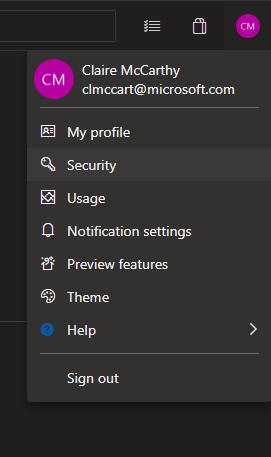
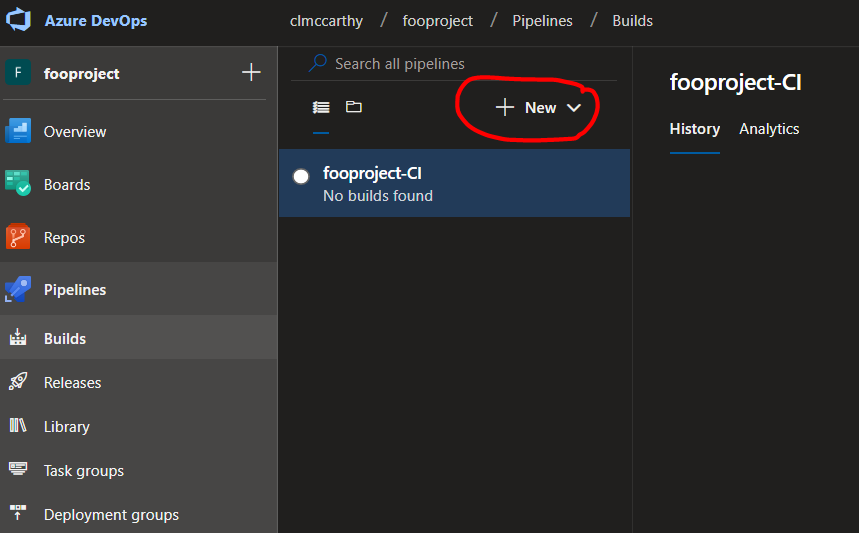

# Abstract
This project serves as a potential template for ML projects that require DevOps practices. The project is currently in dev. Desired end-state is as follows:
- Data scientists are able to experiment in notebooks in the "experiment_nbs" directory.
- Once they have completed experimentation and are ready to operationalize their code, they can convert their notebooks to pyfiles under the "src" directory.
    - Within the notebooks and the pyfiles, they can leverage the DataIngestor and DataPreprocessor classes which handle data ingestion and data preprocessing (duh) and are covered by tests. They can also add methods to these classes and the accompanying tests.
- Any commits under the src directory in master will trigger a Build pipeline which will run all the tests. If the tests all pass, it will also build the model using the operationalized .py file and register it with AzureML.
- The Build pipeline will produce the registered model as an artifact which will automatically trigger a Release pipeline which will include manual gates, QA in ACI, and Prod in AKS.
- This project will also contain a .yml file for easy and consistent environment setup. 
    

# Setup
The steps included in this section only need to be completed once for a project by one person. Once these steps have been completed, each developer on the team can skip to the "Start Using the Project" section to set-up their local development environment and start using the project. 

## Setup Access
First, you will need to generate an access token for the organization.
1) Navigate to your profile in the top right corner of Azure Devops and clock on "Security"

    

2) Click on "Personal Access Tokens" on the left hand menu
    
    

3) Create a new personal access token and enter the following values:
- Name: repotoken
- Expiration: custom defined, as far in to the future as you need
- Scopes: custom defined
- Code: Full
4) Click "create" and make sure to copy your token so that you have it for a step later. Once you exit this window, you will not be able to get this token.

## Setup Repo
1) Clone [this](https://clmccarthy.visualstudio.com/_git/mlopstemplate) repo locally. 
2) cd into the newly cloned repo and delete the .git folder to deassociate it with the current git repo by running this command:
    ```
    rm -r .git
    ``` 
3) Now that you have a clean project folder, we now need to associate it with our new project by running the following commands (fill in the brackets with the url of the repo in your new project):
    ```
    git init .
    git remote add origin <new project repo url>
    git config credential.helper store
    git push -u origin --all
    ```
4) A pop-up window will appear asking you to enter a username for the organization. Here we will use the token that we generated in the previous section. You can enter any value you would like for "username" and then enter your personal access token for "password"
5) Run a "git status". You should see that all of the files appear as untracked. Run the following git commands to add all of the files to your repo:
    ```
    git add .
    git commit -m "initial commit"
    git push origin master
    ```
You now have a setup repo! You can navigate into your AzureDevOps project and see your code in the repo.

## Setup Pipelines
You will find everything you need for this step in the [proj_setup/pipelines](proj_setup/pipelines) folder. This folder contains json file templates for both the Build and the Release pipeline. Follow the following steps to import them into your project:
1) Navigate to the Builds tab and add a new Build

    

2) Select, "Import a pipeline". A pop-up menu will appear. Navigate to the proj_setup/pipelines folder in your local file system. Select the "model Build-CI.json" file and click "Import".
3) A build will appear that looks like this:

    

4) Fill in the settings that need attention:
- Agent pool: Azure Pipelines
- Agent specification: ubuntu-16.04
5) Specify your Azure Subscription for the Azure CLI tasks by selecting your subscription and clicking "Authorize" (make sure to do this for the "Install AzureML CLI Extension" task and the "Register model with AzureML" task)
*Note: If you do not have permissions to authorize, ask somebody who does to create a service connection

    

6) Make sure your Sources are pointing to the correct project and repo. Now, save your Build pipeline

7) Now we will setup the Release pipeline by following the same steps for the Build pipeline but as a Release pipeline.
8) Import the "Release.json" pipeline template to the Releases and fill in the settings that need attention with the same values used for the Build pipeline
9) The only additional variables that you will need to fill in are under the "Variables" tab. Fill in the "resourceGroupName" and the "workspaceName" with the values for the AzureML workspace that you would like to manage your ML workflow. You will also need to fill in the secured values for your blob container
    
10) The last thing you will need to do is specify approvers for both the QA and Prod stages

    

11) Next you will need to add in your artifacts. We will add 2 artifacts to this Release:
    1) Add a new artifact from the Build and name it "_model_metadata" and set the CD trigger

        

        

    2) Add the repo as an artifact and give it the alias "_repo"
        
        

Save your Release pipeline. Your Build and Release pipelines are now fully setup.

Your project is now fully setup and you are now ready to setup your development environment and start using the project.

# Start Using the Project

## Secrets Setup
    
2) You will need to recreate the secrets.json file with the secrets for the blob where your data is stored. This file will be saved in the root directory and have the following format:

    

Once your have your secrets set-up, you are ready to start using the project. Below is guidance on how best to use this project and how you can expect it to behave.

# Notebooks
Some options for making code reviews / source control / PRs easier with jupyter notebooks:
1) manually clear all outputs before pushing to repo
2) utilize [this](https://marketplace.visualstudio.com/items?itemName=ms-air-aiagility.ipynb-renderer) extension for rendering in repo (does not render in PRs)

# Workflow
## Data Ingestion
The DataIngestor class serves to abstract away the process of pulling data into a dataframe. Adjust the DataIngestor class as needed depending on where your data lives. The interface that this class follows is that it takes in a filename and a json of secrets and it returns a dataframe. The default DataIngestor class pulls from blob store. The DataIngestor class will look for the secrets.json file that you pass in. If it is not present, it will pull the secrets from environment variables.
 
Use the DataIngestor class in a notebook as so: 
```python
import sys
sys.path.append("..")
from src.data_ingestion.data_ingestion import DataIngestor

ingestor = DataIngestor(<file name you want in your df>)
df = ingestor.get_df()
```
Import the DataIngestor class in a python script as so:
```python
import sys
from os import path
sys.path.append(os.path.join(os.path.dirname(__file__), '..', '..'))
from src.data_ingestion.data_ingestion import DataIngestor
```

## Data Preprocessing
In order to add preprocessing steps, add functions to the DataProcessor class. Make sure these functions are covered with tests. 
To use the DataPreprocessor, just call the constructor and then the steps in sequential order that you would like to apply. Like so:
```python
from src.data_preprocessing.data_preprocessor import DataPreprocessor

dp = DataPreprocessor(df)
dp.drop_columns(['sepal_length'])
dp.remove_rows_based_on_value(column_name='sepal_width', 
                            bad_values=[3.5])
df = dp.get_df()
```
## Experimentation
Experiment in jupyter notebooks 
Save your experiment notebook in the experiment_nbs directory with your alias as a prefix.

## Operationalize
Once you get to a place with your experimentation notebook where you would like to save the model, export the notebook as a .py file and modify it so that it can run as an independent script that outputs a .pkl file.


*Note: make sure to update requirements.txt with any dependencies
Whenever there is an update to the code on the master branch outside of the experiments_nb folder, a CI build will be triggered that will run all tests and fail if the new code has broken anything.
Whenever there is an update on the master branch to the "src/model_building" folder, a model build will be triggered in addition to the regular build which will register the model with AzureML. Once the build is complete, that will trigger a release.

*Note: any code in the src folder is expected to be covered by tests.

## Deployment
When a build artifact is published, that will automatically queue a Release pipeline. There are two stages in this Release: QA and Prod.
Beofre the QA stage begins, you will need to approve the stage. Once approved, the QA stage will use the Build artifact to deploy to ACI. It will also make a POST Request to the deployed endpoint using the data contained in .azureml/test.json. If the response back is abnormal, the Release pipeline will fail. If not, it will continue on to the Prod stage.
Before approving the Prod stage, check the output from the QA POST Request task to make sure that the repsonse back is what you would like. Once approved, the Prod stage will deploy the model to AKS and do a similar testing to the QA stage.
The Release pipeline deploys using AzureML and requires the developer to write the score.py file and ensure that the .azureml/conda_dependencies.yml file is update with any packages that score.py will need.
If you make a change to score.py and want to update your deployment, you will have to manually queue a release and point it to the most recent build artifact that contains a model_metadata file. A model_metadata build artifact will only be produced if there was a change made to a file in the src/model_build folder. Therefore, you will have to go back to the most recent build that contained a change to a file in that folder and select it as the build artifact when manually queuing a new release with the updated score.py

# TODO:
1) Integration tests for data_ingestion.py
2) Documentation for all py files
3) Secret handling for data_ingestion.py
4) Create yml file for easy environment setup
5) Lock down master branch
6) Documentation for data preprocessor
7) Dynamically configure conda dependencies based on requirements.txt
9) Figure out how to specify modelname or score.py
11) Research reusability of AzDO projects
12) Scratch to CI/CD from new project
13) Add linter

Note: pkl files are git ignored. This makes it so that the only way a model can be registered is if it successfully completes the build.
To change this, remove the .pkl line in the gitignore.
